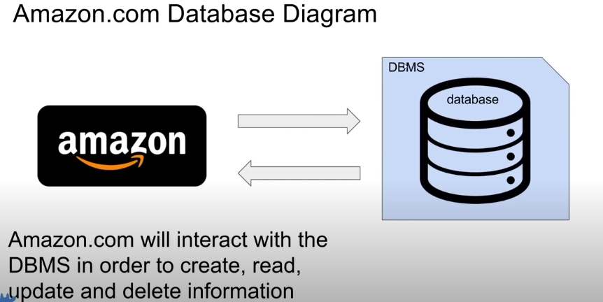
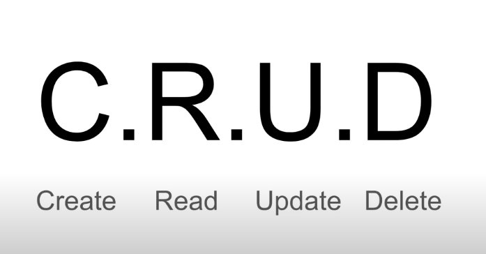
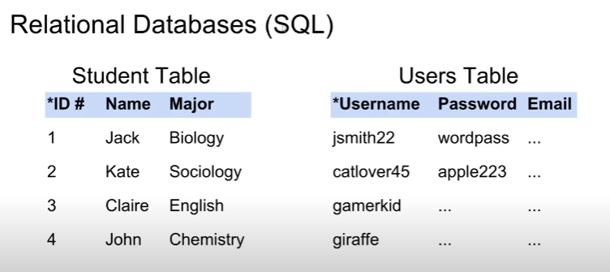
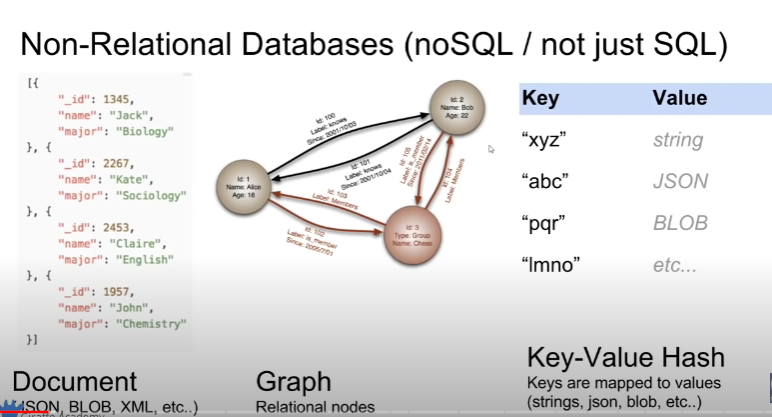
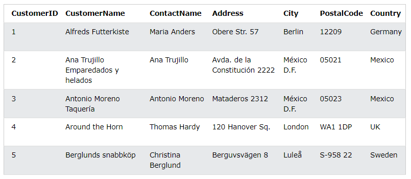

# What is a Database (DB)?

- any collection of related information
  [1] - Phone Book 
  [2] - Shopping List 
  [3] - Todo List 
  [4] - Your 5 best friends 
  [5] - Facebook's User Base 

- Databases can be stored in different ways
  [1] - On Paper 
  [2] - In your mind 
  [3] - On a computer 
  [4] - This powerpoint 
  [5] - comment section 

## Computer + DATABASES = <3

## Amazon.com

- keep track of products,reviews,purchase orders, credit cards, media, etc.
- Trillions of pieces of information need to be stored and readily available
- Information is extremely valuable and critical to Amazon.coms functioning
- Security is essential, amazon stores peoples personal information
- Information is stored on a computer

## Shopping List

- Keeps track of consumer products that need to be purchased
- 10-20 pieces of information need to be stored and readily available
- Information is for convenience sake only and not necessary for shopping
- Security is not important
- Information is stored on a piece of paper,or even just in someone's memory
   
  <code>Computers are great at keeping track of large amounts of information</code>  

## Database Management Systems(DBMS) 

- A special software program that helps users create and maintain a database 
  [1] - Makes it easy to manage large amounts of information 
  [2] - Handles Security 
  [3] - Backups 
  [4] - Importing/exporting data 
  [5] - Concurrency 
  [6] - Interacts with software applications 

  - Programming Languages

<code> sample diagram</code>
 
 

<code><b><h2>C.R.U.D</h2></b></code> 

[C] - Create 
[R] - Read 
[U] - Update 
[D] - Delete 

## Two types of Databases

[1] Relational Databases(SQL) 

- Organize data into one or more tables 

  - Each table has colums and rows
  - A unique key identifies each row
     

 

[2] Non-Relational (noSQL / not just SQL) 

- Organize data is anything but a traditional table 
  - key-value stores
  - Documents (json, xml, etc)
  - Graphs
  - Flexible tables 

 

# Relational Databases (SQL)

- Relational Database Management Systems(RDBMS) 
  - Helps users create and maintain a relational database 
    - mySQL, Oracle, PostgreSQL, mariaDB. etc.
- Structured Query Language(SQL) 
  - Standardized language for interacting with RDBMS 
  - Used to perform </code>C.R.U.D</code> operations, as well as other administrative task (user management, security, backup, etc)
  - Used to define tables and structures
  - SQL code used on one RDBMS is not always portable to another without modification

# Relational Databases (SQL)

- Non-Relational Database Management Systems (NRDBMS)

  - Help users create and Maintain a non-relational database
    - mongoDB, dynamoDB, apache cassandra, firebase, etc

- Implementation Specific
  - Any non-relational database falls under this category, so there's no set language standard.
  - Most NRDBMS will implement their own language for performing C.R.U.D and administrative operations on the database.

## Database Queries

- Queries are request made to the database management systems for specific information
- As the database's structure become more and more complex, it becomes more difficult to get the specific pieces fo information we want.
- A google search is a query

## Wrap UP

- Database is any collection of related information
- Computer are great for storing databases
- Database Management systems DBMS make it easy to create, maintain and secure database
- DBMS allow you to perform the C.R.U.D operations and other administrative tasks.
- Two types of databases, relational and non-relational
- relational databases uses sql and store data in tables with rows and columns
- non-relational data store data using other data structures.

# SQL Tutorial 

- SQL is a standard language for storing, manipulating and retrieving data in databases. 
- SQL stands for Structured Query Language 
- SQL became a standard of the American National Standards Institute (ANSTI) IN 1986, and of the International Organization for Standardization (ISO) in 1987 

## What can SQL do?

- SQL can execute queries against a database
- SQL can retrieve data from a database
- SQL can insert records in a database
- SQL can update records in a database
- SQL can delete records from a databases
- SQL can create new databases
- SQL can create new tables in a database
- SQL can create stored procedures in a database
- SQL can create views in a database
- SQL can set permissions on tables, procedures, and views

## SQL in your WEB site 

to build a website that shows data from a database, you will need: 

- an <code>RDBMS database</code> program (i.e MS Access, SQL Server, MySQL) 
- to use a server-side scripting language,
- to use SQL to get the data you want
- to use HTML / CSS to style the page 

## RDBMS

- stands for <code>Relational Database Management System</code>
- RDBMS is the basis for SQL, and for all modern database systems such as MS SQL server, IBM DB2,Oracle,MySQL, and Microsoft Access.
- The data in RDBMS is stored in database object called tables. A table is a collection of related data entries and it consist of columns and rows.
  > SELECT \* FROM Customers;

## Database Tables

- a database most oftern contains one or more tables.Each table is identified by a name(e.g "Customers" or "Orders").Tables contain records (rows) with data. 
   
- the table above contains five records(one for each customer) and seven columns (CustomerID, CustomerName, ContactName, Address, City, PostalCode, and Country) :

## SQL Statements  

Most of the actions you need to perform on a database are done with SQL statements 

> SELECT \* FROM Customers;

Note: 
<code> Keep in Mind That...</code>

- SQL keywords are <code>not case sensitive</code>: 
- <b><u>select</u></b> is the same as <b><u>SELECT</u></b>. 

## Semicolon after SQL Statements? 

- some database systems require a semicolon at the end of each SQL statement. 
- semicolon is the standard way to separate each SQL statement in database systems that allow more than one SQL statement to be executed in the same call to the server. 

### Some of the Most Important SQL Commands

- <code>SELECT</code> - extracts data from a database 
- <code>UPDATE</code> - updates data in a database 
- <code>DELETE</code> - deletes data from a database 
- <code>INSERT INTO</code> - insert new data into in database 
- <code>CREATE DATABASE</code> - creates a new database 
- <code>ALTER DATABASE</code> - modifies a database 
- <code>CREATE TABLE</code> - creates a new table 
- <code>ALTER TABLE</code> - modifies a table 
- <code>DROP TABLE</code> - delete a table 
- <code>CREATES INDEX</code> - creates an index (search key) 
- <code>DROP INDEX</code> - deletes an index 

## SQL Select Statement 

the <code>SELECT</code> statement is used to select data from a database. 
